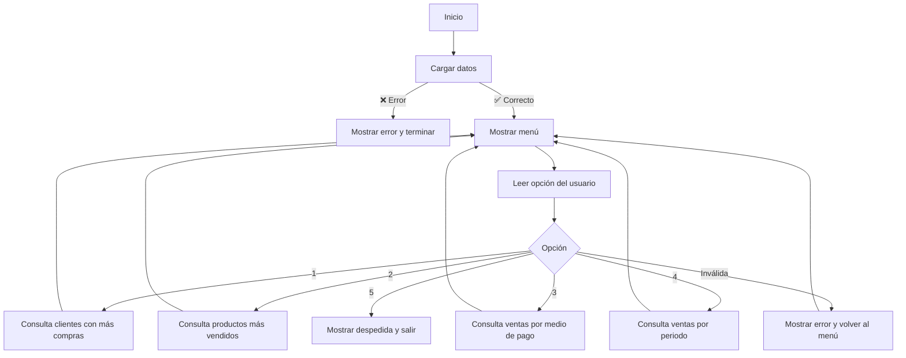

# 🛍️ Proyecto Aurelion - Documentación Principal

## 1️⃣ Demo Asincrónica

**Alumno:** Mario Santander

---

## 📘 1. Tema / Problema / Solución

### 🧩 1.1 Tema

Proyecto educativo: **Sistema de gestión de ventas y clientes** para una pequeña tienda ficticia llamada **"Aurelion"**.
Diseñado con fines de aprendizaje en bases de datos y análisis de información.

### ❗ 1.2 Problema

La tienda "Aurelion" necesita organizar y analizar la información de sus clientes, productos y ventas para mejorar la toma de decisiones.
Actualmente, los datos están dispersos en varias tablas, lo que dificulta:

* Consultar qué clientes compran más.
* Conocer qué productos son más vendidos.
* Analizar las ventas según fechas o medios de pago.

### 💡 1.3 Solución

Se diseña una **base de datos relacional normalizada** con cuatro tablas principales:
`clientes`, `productos`, `ventas` y `detalle_ventas`.

El proyecto permite practicar conceptos de **modelado, normalización y análisis** en un entorno educativo.
Los datos son simulados y cargados desde archivos Excel.

---

## 🗂️ 2. Dataset (Fuente, Estructura, Tipos y Escala)

**Fuente:** Archivos Excel generados para fines educativos, ubicados en la carpeta `base de datos/`.
**Definición:** Representa la gestión de clientes, productos y ventas.

### 📋 2.1 Tablas Normalizadas

#### 🧾 Productos (`productos.xlsx`) ~100 filas

| **Campo**          | **Tipo** | **Escala** |
| :----------------- | :------- | :--------- |
| 🧾 id_producto     | int      | Nominal    |
| 📦 nombre_producto | str      | Nominal    |
| 🏷️ categoria      | str      | Nominal    |
| 💲 precio_unitario | float    | Razón      |

#### 👥 Clientes (`clientes.xlsx`) ~100 filas

| **Campo**         | **Tipo** | **Escala** |
| :---------------- | :------- | :--------- |
| 🆔 id_cliente     | int      | Nominal    |
| 🙋 nombre_cliente | str      | Nominal    |
| ✉️ email          | str      | Nominal    |
| 🌆 ciudad         | str      | Nominal    |
| 📅 fecha_alta     | date     | Intervalo  |

#### 💰 Ventas (`ventas.xlsx`) ~120 filas

| **Campo**     | **Tipo** | **Escala** |
| :------------ | :------- | :--------- |
| 🆔 id_venta   | int      | Nominal    |
| 📅 fecha      | date     | Intervalo  |
| 🧾 id_cliente | int      | Nominal    |
| 💳 medio_pago | str      | Nominal    |

#### 📦 Detalle Ventas (`detalle_ventas.xlsx`) ~343 filas

| **Campo**      | **Tipo** | **Escala** |
| :------------- | :------- | :--------- |
| 🆔 id_venta    | int      | Nominal    |
| 🧾 id_producto | int      | Nominal    |
| 🔢 cantidad    | int      | Razón      |

### 🔍 2.2 Importancia de la Normalización

La normalización:

* Elimina **redundancia** de datos.
* Asegura **integridad** y consistencia.
* Evita **inconsistencias** al actualizar registros.
* Facilita **escalabilidad y mantenimiento**.

Solo se almacenan los **identificadores (IDs)** y las relaciones se obtienen mediante consultas (`JOINs`).

---

## 💻 3. Programa en Python

### 🧠 3.1 Funcionalidad

El programa permite:

* 📋 Listar clientes y sus compras.
* 🏆 Identificar productos más vendidos.
* 💳 Analizar ventas por medio de pago.
* 📅 Calcular ventas totales por periodo.

### ⚙️ 3.2 Pasos del Programa

1. 📂 Cargar los archivos Excel en **DataFrames** (pandas).
2. 🔗 Relacionar tablas mediante `id_cliente`, `id_producto`, `id_venta`.
3. 🛠️ Definir funciones de consulta.
4. 📊 Mostrar resultados o exportar a reportes.

---

## 📜 4. Pseudocódigo

```text
INICIO
==================================================
 Bienvenido al programa de gestión de datos
           Tienda Aurelion
==================================================

Intentar cargar los datos:
    clientes = cargar_clientes()
    productos = cargar_productos()
    ventas = cargar_ventas()
    detalle_ventas = cargar_detalle_ventas()
Si ocurre error:
    ❌ Mostrar mensaje de error
    🔚 Terminar programa

Mostrar mensaje de bienvenida

Mientras el usuario no elija "Salir":
    Mostrar menú de opciones
    Leer opción

    Si opción == 1: 🧾 clientes con más compras
    Si opción == 2: 📦 productos más vendidos
    Si opción == 3: 💳 ventas por medio de pago
    Si opción == 4: 📅 ventas por periodo (con fechas)
    Si opción == 5: ✅ salir

FIN
```

---

## 🔁 5. Diagrama de Flujo



---

### Se utilizo chatgpt para mejorar visualmente este archivo .md

---

## ✍️ 6. Autor

**Mario Santander**
Proyecto educativo desarrollado en Python y bases de datos.
